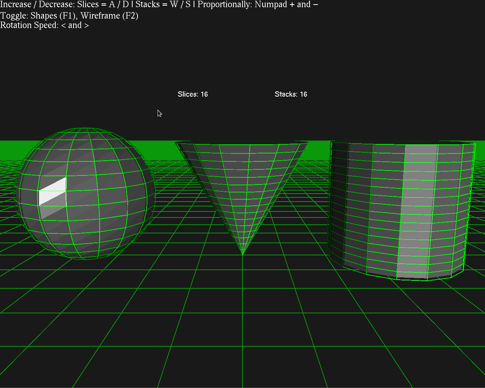

# OpenGL Vertex Demo

This was a small project I did for coursework in college to illustrate vertices/faces/edges in 3D models and to learn/use a bit more of C++/OpenGL. I also keep it here to remind myself of how bad my code was.

It uses freeGLUT as the toolkit for OpenGL, and more than likely won't compile without finding compiled libraries from corners of the internet and linking them.

You can see a preview of what it'd look like here:

